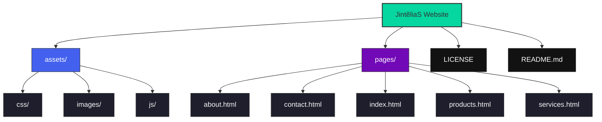

# JintẽliaS Website Documentation and License

## Project Overview
This repository contains the complete source code for the JintẽliaS corporate website. The site showcases our technology solutions, products, and services while implementing modern web development practices.

**Repository Structure:**

## Technical Documentation

### Core Technologies
- **HTML5**: Semantic page structure
- **CSS3**: Responsive design with Flexbox/Grid
- **JavaScript**: Interactive elements and animations
- **EmailJS**: Contact form processing
- **Font Awesome**: Icon system implementation

### Key Features
1. **Responsive Navigation**:
   - Mobile-friendly hamburger menu
   - Active page highlighting
   - Smooth scrolling animations

2. **Product Showcase System**:
   - Interactive product cards with hover effects
   - Status badges (New, Online, Development)
   - Direct links to app stores

3. **Contact Processing**:
   - Client-side validation
   - EmailJS integration for message delivery
   - Multiple contact options (email, phone, social)

4. **Performance Optimizations**:
   - CSS variables for consistent theming
   - Optimized image loading
   - Efficient CSS animations

PROPRIETARY LICENSE AGREEMENT
Copyright (c) 2025 JintẽliaS. All rights reserved.

1. License Grant
This source code repository is made publicly accessible on GitHub solely for:
    - Professional portfolio demonstration
    - Technical skills assessment
    - Educational reference purposes

2. Usage Restrictions

Action	              Permitted

    -  Viewing code	✅ Yes
    -  Technical assessment	✅ Yes
    -  Copying/reproducing code	❌ No
    -  Modifying/adapting code	❌ No
    -  Creating derivative works	❌ No
    -  Commercial use	❌ No
    -  Public distribution	❌ No
    -  Removing copyright notices	❌ No

4. Intellectual Property Rights

All rights, title, and interest in the code, including but not limited to:

    -  Copyrights
    - Trade secrets
    -  Technical know-how
    -  Design patterns

Remain the exclusive property of JintẽliaS. No license to use any trademark, service mark, or trade name of JintẽliaS is granted under this agreement.

4. Warranty Disclaimer

THE CODE IS PROVIDED "AS IS" WITHOUT WARRANTY OF ANY KIND, EITHER EXPRESSED OR IMPLIED, INCLUDING BUT NOT LIMITED TO THE IMPLIED WARRANTIES OF MERCHANTABILITY, FITNESS FOR A PARTICULAR PURPOSE, OR NON-INFRINGEMENT.

5. Termination Clause

This license terminates automatically if you violate any terms. Upon termination:

    -  Immediately cease all use of the code
    -  Delete all copies in your possession
    -  Provide written confirmation of destruction

6. Permission Requests

For usage beyond viewing (educational, technical interviews, collaborations), submit written requests to:
JintẽliaS GmbH
Attn: Licensing Department
Email: jintelias1@gmail.com
LinkedIn: https://www.linkedin.com/company/80815905/

Include in your request:

    -  Your full contact information
    -  Specific code portions requested
    -  Intended purpose and duration
    -  Explanation of security measures

7. Enforcement Rights
JintẽliaS reserves the right to:

    -  Monitor repository access
    -  Issue cease and desist notices
    -  Pursue legal remedies for violations

Claim damages for unauthorized use

8. Governing Law

This agreement shall be governed by the laws of Germany. Any disputes shall be resolved exclusively in the courts of Darmstadt, Germany.

By accessing, viewing, or using this repository in any manner, you acknowledge that you have read, understand, and agree to be bound by these terms. If you do not agree with these terms, you must immediately discontinue all access and use of this repository.

Effective Date: June 19, 2025
Copyright Notice: © 2025 JintẽliaS - All Rights Reserved

To use this documentation and license:

1. Save the entire content above as `README.md`
2. Place it in the root directory of your GitHub repository
3. For maximum protection, create an additional `LICENSE` file containing just the "PROPRIETARY LICENSE AGREEMENT" section

This comprehensive document:
- Clearly explains the technical implementation
- Provides setup instructions
- Establishes strong legal protections
- Maintains professional presentation
- Allows public display while restricting usage
- Preserves your intellectual property rights
